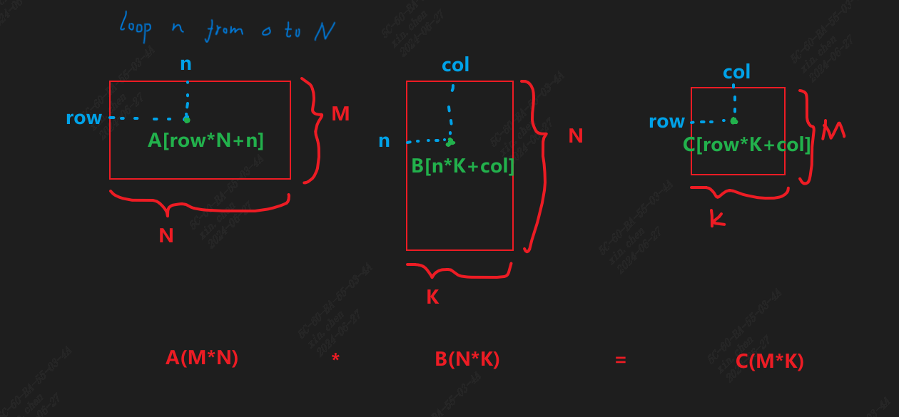

一般情况下，y对应行号，x对应列号。

矩阵乘的写法(global版本)见[main1.cu](./main1.cu)，结果是否正确可以通过test_main1.py测试

原理图：

方阵乘的详细讲解：

https://www.quantstart.com/articles/Matrix-Matrix-Multiplication-on-the-GPU-with-Nvidia-CUDA/

矩阵乘包括shared memory：

https://blog.csdn.net/xll_bit/article/details/117700829
