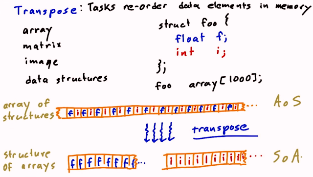
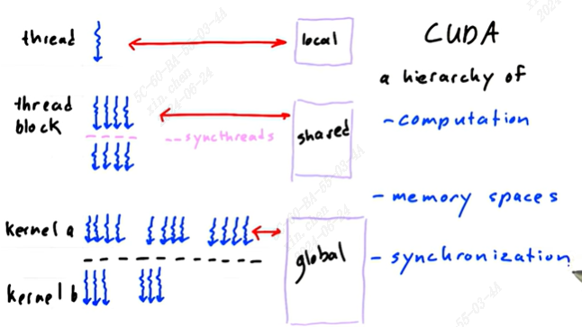

# communication patterns

map       单一映射  
gather    多输入单输出，例如求平均值   
scatter   单输入多输出，与gather相反  
stencil   特殊的gather，从固定的相邻元素读入（上下左右前后）  
transpose 元素重排，包含所有元素

array of structures (AoS) / structure of array (SoA):



# SM，block，thread的关系
SM是streaming multiprocessor

一个block由多个thread组成，包括一维到三维的设置（想象成立体的），可以获取对应的xyz id。

block如何放到SM中是由底层操作的，对用户不可见。同一个block不可能放到多个SM上，多个block可以放到同一个SM上。

一个核函数用到的所有block都会在下一个核函数执行之前完成，即当前核函数执行过程中不会被打断。但不同核函数可能放在不同的地方同时执行。

local memory只能线程自己访问，shared memory可以同一个block上的线程都访问，global memory可以所有block都访问。（这些都是gpu上）


# 同步问题

同步问题其实等价于放置路障（place barrier），在某个语句后执行同步操作，等前面所有语句执行后，再开始后续任务（拦下所有快的任务，等慢的任务完成）。

主要需要注意的问题还是读写问题。（先读后写，先写后读...

一个例子，将长128的数组左移一位并输出，需要几次同步：

```c++
int idx = threadIdx.x
__shared__ int array[128];
array[idx] = threadIdx.x;
if(idx < 127){
  array[idx] = array[idx+1];
  printf("%d", array[idx])
}

```

其实是3步：数组初始化 | 读出数据 | 写数据 | 打印

```c++
int idx = threadIdx.x
__shared__ int array[128];
array[idx] = threadIdx.x;
__syncthreads();

if(idx < 127){
  int temp = array[idx+1];
  __syncthreads();
  array[idx] = temp;
  __syncthreads();
  printf("%d", array[idx]);
}
```
需要注意的是，打印也包含一个读操作，因此需要先同步

整体总结如下：



# 并行编程技巧

## 1. maximize arithmetic intensity

$$
\frac{math}{memory}
$$
增加每个线程的计算操作，减少每个线程花在内存操作的时间


### 1.1 减少花在存储的时间

将常用数据放在更快的内存部分

访问速度比较：local > shared >> global >> host(cpu)

local、global memory的使用参考[main1_1.cu](main1_1.cu)

shared memory 这个例子不太好，原文是将global的数组传给shared数组，然后对shared数组求平均值，但是sum和average是local variable，因此没办法真正的求和，然后求平均值。正常的做法可能是，所有线程分别读取数组对应元素到共享变量，最终一个线程来计算总和和平均值。这里补充了一个[main1_2.cu](main1_2.cu)对应这个部分。

### 1.2 coalesced global memory access

coalesced： 所有线程访问相邻的元素
strided： 所有线程访问元素中间有间隔
random：  所有线程随便取

以下哪个是coalesced：

```c++
__global__ void foo(float *g){
  float a = 3.14;
  int i = threadIdx.x;
...
  g[i] = a;                       // 1
  g[i*2] = a;                     // 2
  a = g[i];                       // 3
  g[i] = a * g[BLOCK_WIDTH/2+i];  // 4
  g[BLOCK_WIDTH-i] = a;           // 5
}
```

1是，访问的都是相邻的。
2不是，是strided。
3是，同1，一个是写一个是读。
4是，同1。
5是，虽然访问index是递减的，但也是相邻的。

### 1.3 原子操作
原子操作会减慢访问内存的速度。浮点操作不满足结合律（我不知道为啥这里要说这个）

以下操作是不是得到正确结果，速度排序由快到慢是怎样的

1. $10^{6}$ threads incrementing $10^{6}$ elements
2. $10^{6}$ threads atomically incrementing $10^{6}$ elements
3. $10^{6}$ threads incrementing 100 elements
4. $10^{6}$ threads atomically incrementing 100 elements
5. $10^{7}$ threads atomically incrementing 100 elements

只有3是错的，速度排序3>1>4>2>5

3>1和4>2是因为100个元素可以完全放在cache中，不用重复读写，但$10^{6}$不行。5的耗时是4的10倍。原子量上线程数越多不是越好的。

## 2. avoid thread divergence

diverge: 不同线程走不通的if分支，或者for循环不同次数（比如: for (int i=0; i< threadIdx; i++>)）

硬件喜欢同时让线程执行相同的代码，这样更好的加速。不同线程for循环不同次数，可能会导致循环次数少的线程等待，到for循环结束后的语句再一起执行。