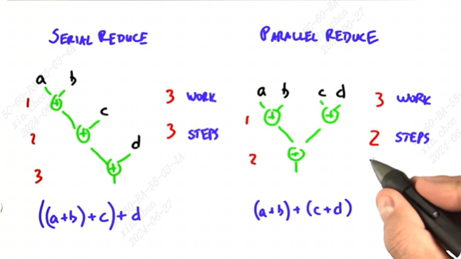
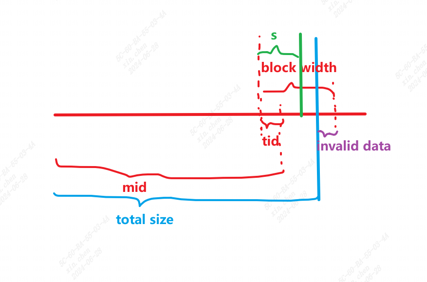
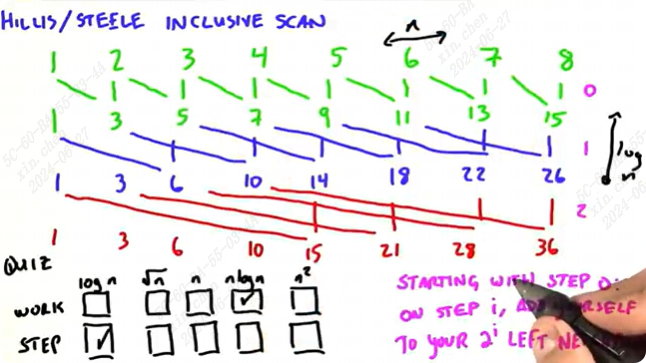
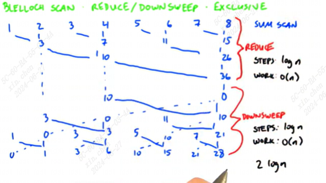
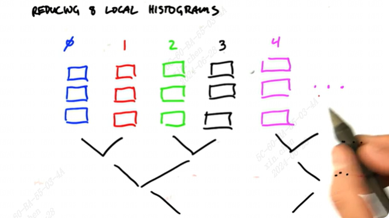

# fundamental gpu algorithms

衡量指标：step complexity 和 work complexity

将这个任务想象成一个树结构，多输入（叶节点）到单输出（根）。step是树的层数，work是树的节点数

时间复杂度与输入个数有关

## 1. reduce
可以减少step

操作是二元的，满足结合律（is associative)。

以加法为例：

这个方式将step的复杂度从o(n)缩减到o(logn)

需要注意的是，线程是有限的，如100万个数求和是没有50万个线程一次性处理step1的。因此这个算法需要考虑到处理器个数的限制。

布伦特定理（brent theorem）讨论上述处理器有限的问题，后续可以研究下？

global和shared的写法在[main.cu](./main.cu)中，不知道为啥好像shared更慢一点，有可能是没warmup

完整的reduce写法在[main1.cu](./main1.cu)。需要注意的是最后一个block不总是满数据的，需要特定处理一下，示意图如下：

我们在最后一个block中处理的数据的索引一定满足这个条件：

$tid<s\ \&\&\ mid+s < total_size$

因此这里有两种处理方式：
1. 对于整个block中，只处理上述条件内的数据（main1.cu中的add_reduce1）
2. 将上述条件以外的数据(invalid data)置为identity element，处理整个block的数据。例如：求和置0，求积置1，求最小值置MAX_VALUE等。（main1.cu中的add_reduce2）

## 2. scan

定义：  
$A = [a_0, a_1 ... a_{n-1}]$  
excludsive scan: $scan(A) = [I,\ a_0,\ (a_0\ \oplus\ a_1),\ ...\ (a_0\ \oplus\ a_1\ ...\ \oplus\ a_{n-2})]$ （当前输出元素不包括当前输入元素）   
includsive scan: $scan(A) = [a_0,\ (a_0\ \oplus\ a_1),\ ...\ (a_0\ \oplus\ a_1\ ...\ \oplus\ a_{n-1})]$   （当前输出元素包括当前输入元素）

I is identity element，$I \oplus e = e$

输入是一个array，二元运算，输入和输出元素个数相等。

以运算为加法为例：  
看起来是一个串行任务，但可以使用并行方法，每个output元素都可以用对应输入元素之前所有元素的和来表示。得到每个output元素是上一节的reduce方法，因此step是o(logn)，work是o(n^2)。可以通过以下方法优化：

### 2.1. hillis + steele

是inclusive的。第i次操作时，元素j的值为，
$$
value[i][j] = \left\{\begin{aligned} 
              & value[i-1][j] + value[i-1][j-2^i]\quad  & if\ j-2^i>=0 \\
              & value[i-1][j]\quad  & if\ j-2^i<0 \end{aligned}\right.

$$

step为o(logn)，work为o(nlogn)

可以参考[main2.cu](main2.cu)中的scan_kernel。

### 2.2 blelloch

具体步骤太复杂了，意会。step为o(logn)（实际为2logn，比上面算法慢一些）。work为o(n)，比上面快

## 3. histogram

cumulative distribution function 累积分布函数，（比x值小的部分的函数面积，0到x的定积分）

要获得一个函数的累积分布函数，其实要做一个exclusive scan。

生成直方图的方法：

### 3.1 atomic
每来一个元素，判断属于哪个bin，这个bin的值加1（这个加1是原子的atomic，因为并行情况下有多个线程可能同时访问bin的值）

可以参考[main2.cu](main2.cu)中的histogram_kernel。

### 3.2 局部直方图+reduce

每个线程维护一个局部直方图来处理一部分数据，最后将所有局部直方图的结果相加得到总的直方图（reduce）：（这里一个直方图有3个bin）

### 3.3 排序+reduce
相当于一个键值对，键是bin的序号，值是1。按键排序以后，把键相同的值来reduce，可以得到各键对应的总值。

## 注：用tid作为索引，操作shared memory；用mid操作global memory