# compact

压缩，但更像过滤。例如在扑克牌中只处理方片牌，如果不压缩的话，会启动54个线程，但只有13个线程正常运行，剩下的都是空转；如果压缩，只会启动13个线程。可以节省资源。

步骤：
1. 先判断元素对应true或false，保留为true的地址
2. 创建新的数组，将true的元素置为1，false为0
3. 对新数组做求和的exclusive scan
4. 得到scan output，有效的数据在每段的最后一个，对应的他在新数组的位置（需要倒序遍历，并且最后一个元素是不是有效的需要判断一下）

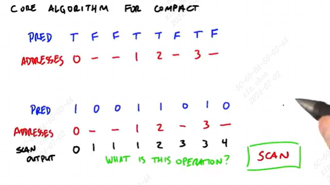

为什么这里不能是inclusive scan？可以顺序遍历并且记录第一个改变的元素（0不算）？

因为这样计算另一种情况的位置更方便，不用再进行一次compact。如上图，如果是T，保存的位置就是scan\[i\]；如果是F，保存的位置就是i-scan\[i\]

# allocate
对于每个输入，可能输出的结果数量并不一样，如果每个输入都按最大的输出数量来分配内存并不是很划算。可以根据输入的条件来用扫描的方式确定内存分配情况。

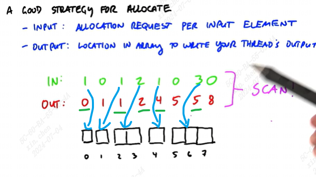

这个扫描的输出就是输入对应的输出数组的索引


# 分段扫描segment scan
一般情况下，如果有多个小数组的扫描，可以将他们合成一个大数组并记录小数组开头的位置，写成一个kernel函数，这样可以节省资源。这个核函数可以传入两个数组，一个是拼起来的大数组，一个是记录小数组开头位置的数组，是开头就为1，不是则为0，如：

(1 2 3 4 5 6 7 8)   
(1 0 1 0 0 1 0 0)   
也就是  
(1 2 | 3 4 5 | 6 7 8)


# 稀疏矩阵表示法
sparse matrices

对于含0比较多的矩阵乘一个向量，可以将这个矩阵拆成三部分：  

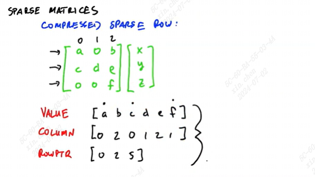

value就是这个矩阵中所有的值，column是value值在矩阵中的列索引，rowptr是矩阵中每行第一个数在value中的索引

用这种方法求矩阵乘的步骤：

1. 将value根据rowptr分段
2. 将column中的列索引用向量中对应的值替换
3. 对应元素相乘
4. exclusive segmented sum scan（分段reduce也行），这个输出放在每段的最后（为什么？）

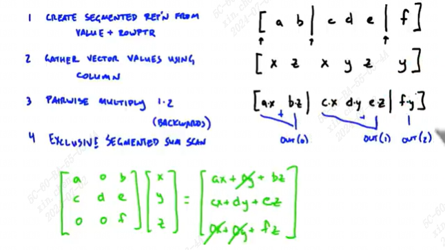

# 并行排序

主要是归并排序，复杂度o(nlogn)

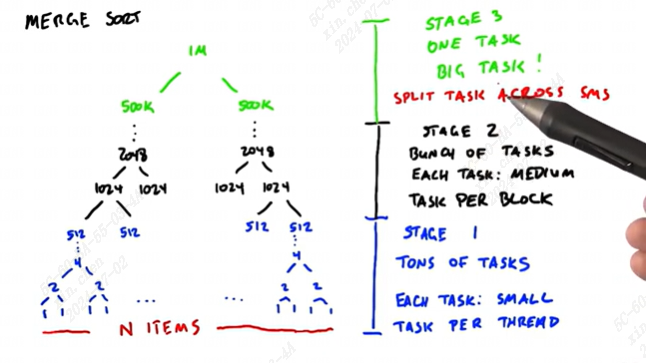

第一阶段：许多小任务，每个任务放在一个thread。可以使用串行的方法而不是归并（两数组判断数组头，取出较小的，使用共享内存）
第二阶段：每个任务放在一个block中，使用并行的归并算法。
第三阶段：很大的任务，任务数较少（不好的地方在于有大量空闲的sm）。

## 并行归并算法（第二阶段）：  
计算两个要归并的数组中所有元素在新数组中的位置（这两个数组都是已经有序的）。数组中的每个元素对应一个线程，该元素在当前数组的索引是已知的，在另一个数组中应该插入的位置可以用二分法求得，两个索引相加就是最终该元素在新数组中的位置。如果数组大小超过共享内存，可以每次只读一部分到共享内存，然后读下一部分。

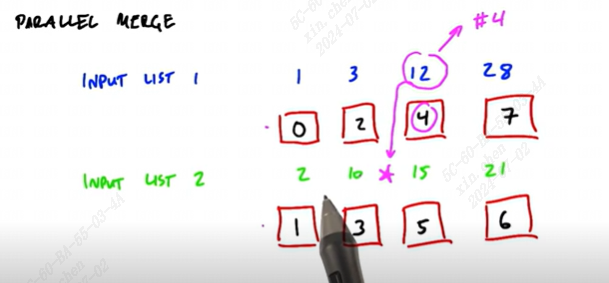

## 分解归并（第三阶段）
将两个长数组按固定长度分段，分段位置用字母表示（这些字母被称为spliters）。将这些spliters按对应的元素大小排序，即可得到所有字母在最终合并完成的结果数组中所在位置的顺序。将不同组字母相邻的区域在两个组中分别取出来做合并操作，这作为一个子任务，不同组字母在组中的位置可以用二分法查找。

以下图来说明，固定长度为256，即下图中字母两两间距是256个元素。将字母对应的元素值排序后可以得到下面红色线段的结果，此时需要排序的是来自不同数组的字母所组成的区间中的元素。例如区间FC，需要排序的两部分是数组1中F元素所对应的位置到C和数组2中F到C对应的位置。BC=FG=256>=FC，因此可以保证每个子任务的长度在一定限制内。F在数组1中的位置可以通过在BC区间内二分查找来获得，C同理。

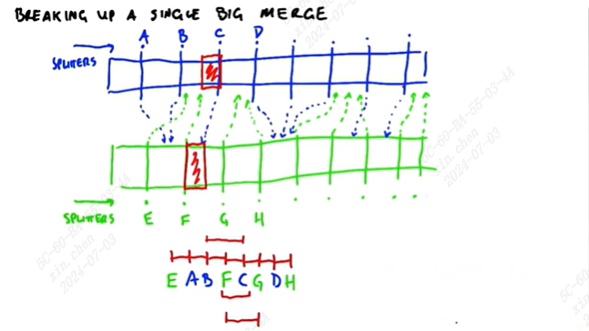

## sorting networks（第一阶段？）-- oblivious
无论输入是什么，这个算法做的事是一样的，只有数据交换操作(swap)，保证每次输入的两个数据的顺序是正确的。oblivious就是与数据的输入没有任何关系，输入一组随机数据和已经完全排序的数据，处理的时间是一样的。（没搜到怎么设计这个网络）

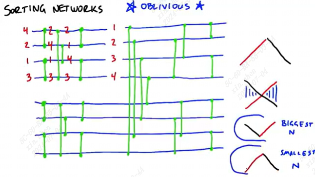

对于双调排序（数组中的元素大小先升后降或先降后生），他可以按照图右侧所示，分成较大和较小两部分（更像一种感觉，不知道原理）

# 基数排序 radix sort

LSB = least significant bit （二进制最低位）

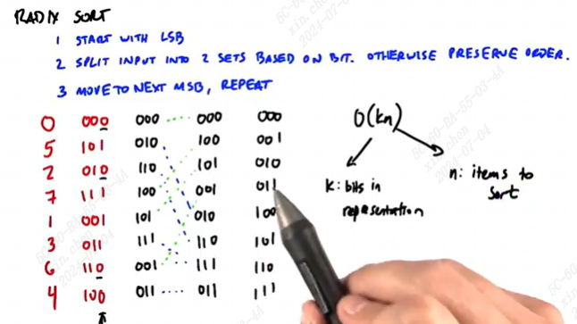

这种排序更适用于整数（无符号数），这个排序方法不存在两个数比较。

从二进制数的最低位开始，将该位为0的数排在前，为1排在后。然后判断前一位的状况进行相同操作，重复直到所有位都判断完。

时间复杂度是o(kn)，一共有k位（32或64），每次都要处理n个数

取出当前位为0的所有数的方法是compact，条件是对该位求&就可以，然后scan出来得到需要提取的元素。在gpu上可以做多个分支的扫描，如4位一判断可以创16分支的，而不只是图中的(0,1)这种二分支。注：扫描的最后一个元素需要额外的判断，因为扫描值增长可能对应两种情况。这里是保留的元素的情况，被过滤掉的情况可以参考本篇开头的compact部分的例子。

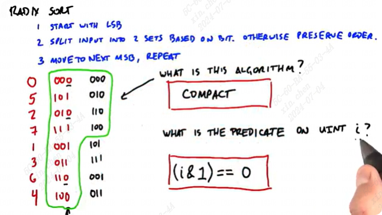

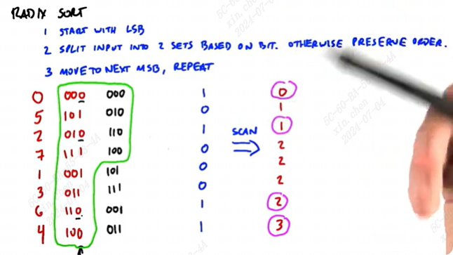

可以先完成单block的基数排序，然后根据这个修改得到多block。

所有元素可以在一个block内完成排序，即元素数量\<blockdim的版本，可以参考[main.cu](./main.cu)

多个block版本，参考[main1.cu](./main1.cu)

以上两个例程有需要注意的地方：
1. exclusive scan的实现方法：在pred数组前面增加Identity element，然后直接inclusive scan。在[main.cu](./main.cu)中有详细说明
2. __syncthreads()同步操作不要放到核函数的if条件语句当中，因为不是所有线程都能到达这个位置。否则可能导致死锁或同步错位的未定义行为。
3. 多block的实现重点在与scan的多block。histogram和元素移动是完全并行的，scan可以分段扫描，但每个分段都要加上上一分段最后一个元素的结果，因此这个部分需要是串行的。参考[main1.cu](./main1.cu)


# 快速排序 quick sort

快排的正常做法：
1. 选一个主元素P
2. 比较每个元素和主元素大小
3. 分成3个集合： \>P =P \<P
4. 对每个集合重复这个步骤

举例如下：
```
      3 5 2 4 1     P=3
      = > < > <
  2 1 P=2 | 3 | 5 4 P=4
    1 | 2 | 3 | 4 | 5 
```

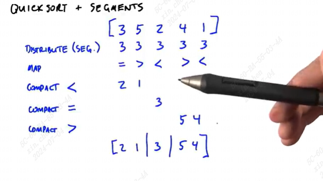

具体咋实现不知道，结合了分段扫描、压缩等

# key value sort
如果value对应的数据很大，可以只将指向数据的指针作为value。这种排序键值需要一起移动，如果可以将键值合在一起就可以更好操作，比如用一个64位数据类型存储32位的键和32位的值，gpu可以直接操作整个64位数据。