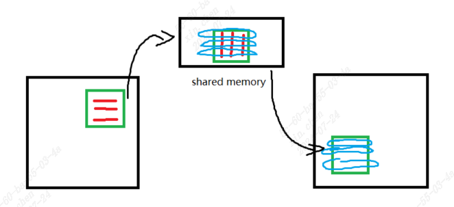
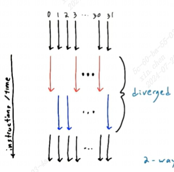
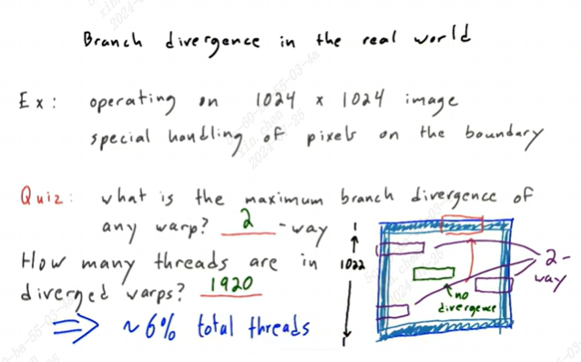
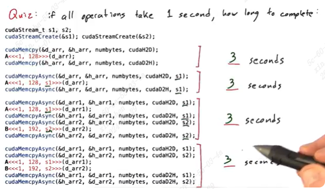
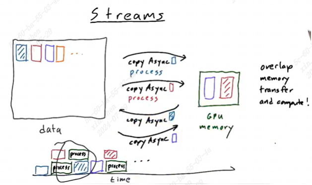

# optimizing gpu programs

以transpose为例（N*N方阵），参考[main.cu](./main.cu)

这个部分我在[cuda教程](https://developer.nvidia.com/blog/efficient-matrix-transpose-cuda-cc/)也看到了。

N=1024

这里的数据和视频中已经对不上了：

我的数据是：    
NVIDIA GeForce RTX 4080    
transpose serial: 28.6781 ms   
transpose_parallel_per_row: 0.468448 ms    
transpose_parallel_per_element: 0.035968 ms

视频中三个值分别是466ms, 4.7ms, 0.67ms（后续计算带宽时以视频内容为主）


时间花费主要在于两个方面：**计算，内存访问**  
transpose不存在计算，只有内存访问时间

**cuda device query 可以提供一些有用信息**    
device query 一般在sample中，可以获取Memory Clock rate (KHz)和Memory Bus Width (bits)。cuda的接口也可以获取到，例如：

```c++
#include <iostream>
#include <cuda_runtime.h>

int main() {
    int deviceCount;
    cudaError_t err = cudaGetDeviceCount(&deviceCount);

    if (err != cudaSuccess) {
        std::cerr << "Error: cudaGetDeviceCount failed!" << std::endl;
        return 1;
    }

    for (int device = 0; device < deviceCount; ++device) {
        cudaDeviceProp deviceProp;
        err = cudaGetDeviceProperties(&deviceProp, device);

        if (err != cudaSuccess) {
            std::cerr << "Error: cudaGetDeviceProperties failed for device " << device << std::endl;
            continue;
        }

        std::cout << "Device " << device << ": " << deviceProp.name << std::endl;
        std::cout << "  Memory Clock rate (KHz): " << deviceProp.memoryClockRate << std::endl;
        std::cout << "  Memory Bus Width (bits): " << deviceProp.memoryBusWidth << std::endl;
    }

    return 0;
}

```
## 1. 优化内存访问

### 带宽

#### 假设memory clock 2508 MHz，memory bus 128 bits，理论最大带宽多少GB/s？

memory clock = 2508*10^6 clocks/sec   
memory bus = 16 bytes/clock   
相乘约为40GB/s （GB是10进制存储单位，GiB是2进制存储单位）

程序运行时带宽达到最大带宽的40~60%是还可以，60~75%很好，>75%非常好

#### memory clock 2508 MHz，memory bus 128 bits，N = 1024，当kernel函数运行时间为0.67ms时，这个函数的带宽是多少？
总共操作的内存大小：1024\*1024\*4 bytes
操作次数（读写）：2
总时间：0.67\*10^(-3) s

1024\*1024\*4\*2/(0.67\*10^(-3)) = 12.5GB/s

也就是说这时DRAM的利用率只有12.5/40=31.25%


### 内存操作
coalescing：访问内存是连续的（global），用共享内存拷贝时可以是连续的  
stride：根据固定步长访问内存

可以用nvvp看各部分内存访问情况和其他信息，只保留核函数就好，删掉计时等其他辅助功能。

优化方式：  
1. 尽量访问连续内存
2. 使用共享内存

#### 共享内存的实现方式
参考[main.cu](./main.cu)中的transpose_parallel_shared



主要过程是
1. 将输入中的一个小块中的元素直接按照转置放到共享内存的对应位置（红色）。输入小块的起始位置是(blockIdx.x * K, blockIdx.y * K)，由于是转置，因此对应关系是shared\[y_shared,x_shared\] = input\[x_in,y_in\]
2. 同步
3. 将共享内存的数据直接按行放到输出中的对应小块（蓝色），这一步相当于直接copy，也就是output\[x_out,y_out\] = shared\[x_shared,y_shared\]。但输出中小块的起始位置变为(blockIdx.y * K, blockIdx.x * K)。

### 如何增加带宽？
1. increase number of bytes delivered
2. decrease the latency (time between transactions)

SM和DRAM中的数据互传需要带宽支持。

访问DRAM一般需要上百个cycle，因此一次传输更多数据是一个更好的做法，让带宽更少闲置：
1. 可以用多个线程同时访问DRAM
2. 用float4一次传输4个float，但代码可能不易理解（类比neon加速）。

减少延迟(latency)的方式：
1. 减少每个block的线程数：因为__syncthread()需要等待当前block中所有线程操作完再继续下一步，线程数越多等待时间越长
2. 增加每个SM的block数：__syncthread()是针对某个block中的所有线程，不同block的线程之间不会相互影响。一个SM上可以有多个block，但一个block只能属于一个SM

### Occupancy占用率
每个SM的以下资源是有限的：（可以通过device query看到）

-- thread blocks  
-- threads  
-- registers for all threads  
-- bytes of shared memory   

因此到底每个SM能有多少个block取决于某个资源条件限制。

例如，当前设备上单个SM有48K shared memory、1536个线程，一个kernel函数要使用16K shared memory、1024个线程，一共可以有几个block？

shared memory可以满足3个block，但线程数只能满足1个，因此这个SM只能有一个block，运行的总线程数是1024，occupancy = 1024/1536 = 66%

可用工具： cuda occupancy calculator

影响occupancy的方式：
1. 调整shared memory
2. 调整kernel使用的block和thread的数量
3. 通过编译选项控制寄存器使用（这个一般不考虑）

提升占用率可以让performance提升到一定程度，因为可以更高程度的并行与内存访问(transaction)，但不能保证GPU运行一定更有效。

例如[main.cu](./main.cu)的transpose_parallel_shared中，如果让tile size (K)变小，每个block的线程数更少，并且可以让更多线程块运行，减少同步的等待时间；但如果tile size太小了，就跟没有使用共享内存一样了。可以尝试K = 32、16、8的情况。


## 2. 优化计算效率--减少divergence

减少__syncthread()的等待时间：这部分在增加带宽的部分涉及到了  
**减少thread divergence**

warp：同一时间执行同一指令的一组线程  
SIMT：single instruction multiple thread

核函数中的语句导致divergence



divergence导致变慢的原因是：对于SIMT，指令是一起执行的，有些指令执行的时候，一些线程不符合这个指令的执行条件，就会等待。如图中红色线程执行的时候蓝色就等待，蓝色执行时红色等待。

### 分支if/switch

有if语句的时候，条件为true的线程先执行if true分支对应的语句，false的线程等待；之后false的线程执行else的语句，true线程等待。然后所有线程再一起执行后续相同的语句。如上图所示，相当于每个分支抑制了不执行这个分支的所有线程。如果一个warp是32个线程，那么对于每个block有1024个线程的情况下，最慢也就是原来的32倍（只是说分支数，此时一个warp中每个线程对应一个分支，等同于switch 32种情况，当然嵌套的if也有可能）

请问以下switch语句最多慢多少倍（假设各分支语句执行时间是一样的）：  
1. switch (threadIdx.x %32){case 0...31}  ; kernel<<<1,1024>>>()
2. switch (threadIdx.x %64){case 0...63}  ; kernel<<<1,1024>>>()
3. switch (threadIdx.y){case 0...31}  ; kernel<<<1,(64,16)>>>()
4. switch (threadIdx.y){case 0...31}  ; kernel<<<1,(16,16)>>>()
5. switch (threadIdx.x %2){case 0...31}  ; kernel<<<1,1024>>>()
6. switch (threadIdx.x /32){case 0...31}  ; kernel<<<1,1024>>>()
7. switch (threadIdx.x /8){case 0...63}  ; kernel<<<1,1024>>>()

答案：
1. 32
2. 32
3. 1
4. 2
5. 2
6. 1
7. 4

一个warp有32个线程。  
对于1，一组warp 0~31的线程走32个case
对于2，一组warp最多32个线程
对于二维的情况，线程排布是按x优先排列的，然后是y，因此取线程组warp的时候先按x取。   
对于3，相同的y有64个x，y的取值只有一种；对于4，相同的y有16个x，因此需要2个y，取值有两种情况
对于5，一组warp只分奇数和偶数两个case
对于6，一组warp除32的得数相同，如(0~31)/32=0，因此只走一个case
对于7，一组warp除8有4个case

另一个例子：

处理一个1024*1024的图片，只有边界上的像素需要单独处理，即:
```c++
if (threadIdx.x == 0 || threadIdx.x == 1024 || threadIdx.y == 0 || threadIdx.y == 1024){
  func1();
} else{
  func2();
}
```



一共有两种divergence warp，只有左边界和右边界所在的warp，不包括第一行和最后一行的边界

线程数图中写错了，应该是1022\*2\*32=65408，占总线程数的65408/(1024*1024)=6%

这样少的divergence比例其实不需要优化


### 循环

请问以下哪种循环更快，快多少？

```c++
__global__ void foo(...){
  // bar是一个非常耗时的函数
  for (int = 0; i < threadIdx.x%32; ++i){ bar();} // loop 1
  for (int = 0; i < threadIdx.x/32; ++i){ bar();} // loop 2
}
foo<<<1,1024>>>(...);
```
loop1:  0不循环，1循环1次...31循环31次，因此一个warp最终要循环31次，但其中一些线程会被抑制。每组warp情况相同，一共32组，总时间31*32   
loop2:  第0组warp不循环，第1组循环1次...第31组循环31次，总时间(0+31)\*32/2 = 31/2\*32   
因此loop2更快，快2倍

### 减少branch divergence
1. 避免分支代码：如果相邻的线程有可能走不同的分支，重构代码
2. 避免线程的不均衡workload：关注循环或递归调用，重构代码

## 3. assorted math optimizations
### 真正需要double的时候再用

```c
float a = b + 2.5;  // 2.5是double，运算更慢
float a = b + 2.5f;
```
### 用intrinsics
cuda提供了一些内部函数：__sin(), __cos(), __exp()等

精度(float)会比math.h(double)低，但更快。


### host -gpu interaction

在host到device拷贝时，在host上的数据会先拷贝到staging area，然后通过pcie拷贝到GPU   
使用cudaHostMalloc()可以直接分配pinned(page-locked) host memory，这样就可以直接复制了，减少一次拷贝时间。   
也可以使用cudaMemcpyAsync()，异步接口可以让cpu继续执行其他不相关指令，不用阻塞在拷贝。


## stream
sequence of operations that execute in order (memory transfers, kernels)

不同stream是并行的。把不同的指令放到不同的stream中，总完成时间会更短

```c++
cudaStream_t s1;
cudaStreamCreate(&s1);
cudaStreamDestory(s1);
```

问题：
  


对比3和4，最终异步执行时s1和s2都是相同三步。

**异步时需要注意数据的安全性（读写），不同的流涉及到同一变量时需要小心。** 另外，异步时如果一个流已经占用了全部资源，其他流可能会等待。

stream的好处：

1. overlap memory transfer and compute

假设要处理的数据非常大，一次只能放一部分到GPU。普通做法是拷贝GPU大小的一部分到GPU，计算，拷贝回host，拷贝下一块。用stream的话可以每个流每次拷贝GPU大小的一部分，然后做处理。异步操作可以将不同流的拷贝和计算重叠，节省时间。



2. 用小kernel填充GPU
- 并行度有限的问题
- 工作量越来越少的阶段（如递归）

# summary
1. APOD: analyze->parallelize->optimize->deploy->analyze...   
早部署，再优化

2. measure & improve memory bandwidth
- assure sufficient occupancy
- coalesce global memory accesses
- minimize latency between accesses

3. minimize thread divergence
- within warps
- avoid branchy code  (if, switch)
- avoid thread workload imbalance
- 少量的divergence可以忽略(% = divergence thread/total thread)

4. consider fast math
- intrinsics: __sin(), __cos() ...
- avoid using double unless necessary: 3.14 != 3.14f

5. use streams
- overlap computation and cpu-gpu memory transaction