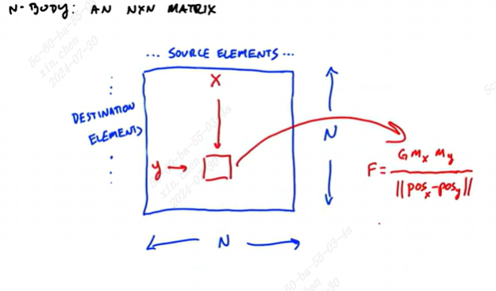
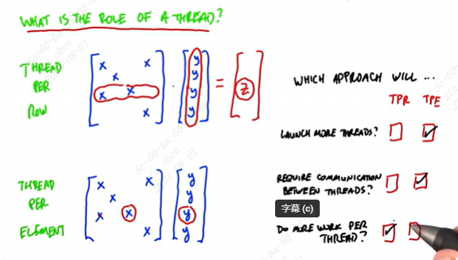
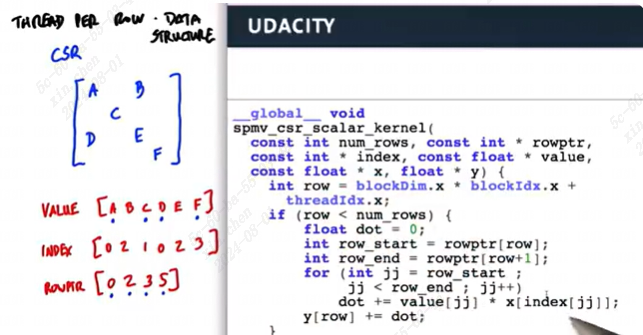
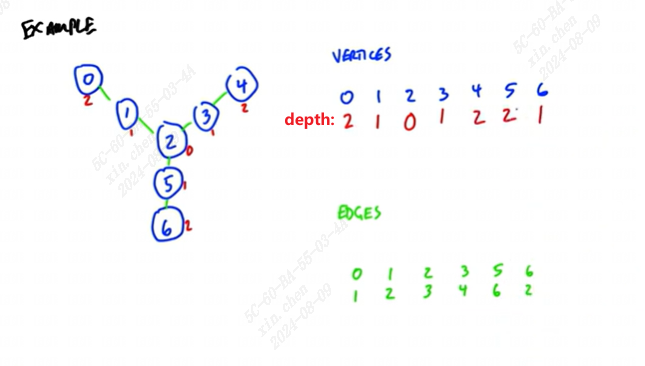

# 一些可并行问题

## dense n-body
all-pairs n-body  
有n个点，每两个点之间有作用力。计算每个点的作用力，根据作用力移动元素位置，循环这个过程。

将所有力表示为一个矩阵，(x,y)代表x元素对y元素的力，因此一个元素受到的所有力就是一整行元素的和。（这里(x,y)是坐标，而不是行列）

类似之前矩阵转置的方式，每个block负责p\*p的tile。如果每个block使用p\*p个线程，好处是可以有p^2的并行操作，但缺点是需要线程之间通信来计算一整行的力总和，需要多次同步。另一种方式是使用p个线程，每个线程负责一行，同步开销会更低，同时并行度也降低了。

这种方法减少了线程数，增加了每个线程的工作量，但是将线程间的通信转换为线程内的通信，线程内通信更快。在较大的任务时，即使单个block线程数少，但总block数多，也可以让gpu保持忙碌，此时效率较高。较小的任务不一定保证gpu繁忙。

P越大tile数量越少，存放在共享内存的数据越多，需要的全局带宽越小；p太大，共享内存可能放不下

block数量应该至少等于SM数量，否则会有SM空闲。一般情况下，tile正好可以占满一个block的共享内存最好。但可以略小一些，这样可以同时让更多的warp在运行，减少latency（这部分不太懂）

N body问题涉及到的主要内容：提升并行度 vs 提高每个线程的workload（线程间communication效率比线程内更低）

## sparse matrix vector multiply（spvm）

有两种方式实现稀疏矩阵乘

### thread per row

CSR: compressed sparse row format

代码中x是被乘的列向量，y是结果列向量。value记录了所有除0以外的矩阵值，index代表value元素在第几列，rowptr则记录了value中每行开头元素的索引。

对于每个线程处理一行的情况，同一个warp的32个线程，处理用时取决于**时间最长的那个线程**。因此如果每行元素个数差不多的情况下运行效率最高。

### thread per element

一个warp的运行时间只取决于矩阵的元素总数，对某行元素个数多少不影响。可以参考[chapter4](../chapter4/note.md#稀疏矩阵表示法)

thread per row在稀疏矩阵每行差不多元素个数的时候效果最好，与thread per element相比，没有线程间通信，这种情况下thread per row 比thread per element快3倍。thread per element更适用于每行元素个数差距较大的时候。

一种比较中和的方式是两种方法的结合

红线分割的经验法则是左边有1/3的行是非零元素。NVIDIA cuSPARSE

### summary
1. 让线程保持busy：每个线程的workload差不多，防止idle
2. 选择cheaper的通信方式：Register（线程内通信）<shared memory （线程间通信）\< global memory

## Breadth-first traversal of graphs（广度优先）

一个不好的算法：参考[main.cu](./main.cu)

V是节点个数，E是边的个数

有一个存边的数组（V*V，记录两节点之间是否有边）。每个节点都统计一个深度。从2作为起始（深度0），先遍历所有连接2的点为深度1，再以此类推

这个算法的最坏复杂度是所有节点串行成一条线的时候，这个时候复杂度是O(VE)，由于一般情况下一个节点可能有多条边，因此为O(V^2)

总结：
1. parallel：不同线程间不需要信息交互，并行代价小
2. memory behavior：存在一些gather和scatter，也还可以
3. thread divergence：没有divergence
4. complexity：O(V^2) 复杂度较高